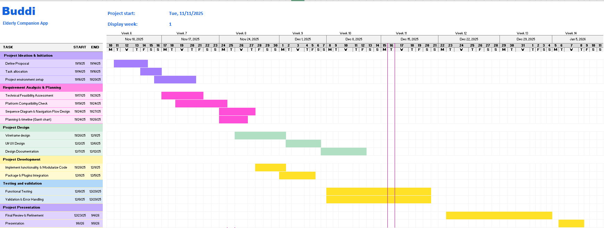

# Buddi 
`Elderly Companion App`

Buddi is an elderly focused companion app that features big, clear buttons for essential functions (call, message, camera, clock, emergency). It also handles medication and hospital appointment reminders, track steps and keeps family members engaged through automated weekly email reports summarizing the user’s activity.

---
 

### Group Members

| Name       | Matric No | Assigned Tasks                                      |
|------------|-----------|----------------------------------------------------|
| ANIS NAZIRA BINTI ABD GHANI   | 2219732   | **1. Project Ideation & Initiation**    Assigned Modules - UI Design, Main page (Big buttons)     **2. Requirement Analysis & Planning**    a. Gantt Chart   b. Screen Navigation Flow   c. Sequence Diagram for Main page (Big buttons)|
| NURAMIRATUL AISYAH BINTI RUZAIDI   | 2212736   | **1. Project Ideation & Initiation**   Assigned Modules - Medication and Hospital Appointments Reminders     **2. Requirement Analysis & Planning**    a. Sequence Diagram for Medication Reminders   b. Sequence Diagram for Hospital Appointments Reminders               |
|AISHA MOHMMED ALWAN ALJUBOORI | 2125992   |**1. Project Ideation & Initiation**   Assigned Modules - Pedometer, Weekly Email Automation     **2. Requirement Analysis & Planning**    a. Sequence Diagram for Pedometer   b. Sequence Diagram for Weekly Email Automation   |

  

# 1. Project Ideation & Initiation

## Background of the problem

Many older adults struggle with modern smartphones because interfaces are small, cluttered, and require multiple steps to perform basic tasks. This leads to **frustration, missed medication and missed appointments.** In Malaysia and many other places, caregivers often need to remind seniors about medication and appointments, or to check activity  a manual process that wastes time and can fail when the senior is alone. There’s a need for an app that **reduces load, supports memory and routine, and helps family members stay informed** without constant calls.

## Objective

1.	To create a simple, reliable companion app that makes essential phone functions and health reminders immediately accessible to elderly users. 
2.	To improve medication and appointment adherence with clear reminders.
3. To provide step tracking to support daily activity monitoring and encourage healthier routines.
4.	To keep family members informed through automated weekly summaries.

## Target users

- **Primary**: Older adults (50+) who are not tech-savvy and prefer simplified interfaces 
- **Secondary**: Family (children, relatives) who want lightweight remote monitoring and an easy way to set reminders.

## Preferred Platform
- Android Mobile App

## Features

### 1. Big Buttons Interface  
- Large, high-contrast icons  
- Adjustable text & button sizes  
- Home screen with essential functions: Call, Message, Camera, Clock 
- Large, always-visible emergency icon that calls designated emergency contact and optionally sends SMS with location  

### 2. Medication Reminders  
- Daily reminders with “Taken / Missed” buttons  
- Family can pre-fill medication schedule  
- Medication history log

### 3. Hospital Appointment Reminders  
- Alerts before appointments  
- Add details like date, location, and notes  
- Optional map navigation

### 4. Step Monitoring (Pedometer)  
- Uses device motion sensor  
- Tracks daily steps  
- Weekly trend summary

### 5. Weekly Family Updates  
- Automatic email report with:  
  - Steps taken  
  - Medications taken/missed  
  - Appointments attended  
  - Emergency activations  
- Keeps families informed without disturbing senior’s routine

 

 # 2. Requirement Analysis & Planning

#### 1.1 Technical Feasibility 
Buddi is developed using **Flutter (Dart)**, enabling a single codebase for  Android smartphones. Flutter supports strong UI design, smooth performance, and a wide range of plugins.

- **Data Storage for CRUD Operations:**
  - **User profile:** 
  - **Medication schedules**
  - **Hospital appointments**
  - **Step count records**
  - **Emergency contacts**
  
  **Storage Solutions:**
  - Cloud: **Firebase Firestore** for real-time, scalable storage  
  - Authentication: **Firebase Authentication**  

- **Packages & Plugins:**
  - `firebase_auth`, `cloud_firestore` – User data & auth
  - `flutter_local_notifications` – Reminders
  - `pedometer` or `health` – Step tracking
  - `url_launcher` – Emergency calls
  - `camera` – Camera access
  - `intl` – Date/time formatting
  - `mailer` or Firebase Functions – Weekly email summaries

#### 1.2 Platform Compatibility
- **Smartphones:** Android

#### 1.3 Logical Design
- **Sequence Diagram**

| Mainpage (Big Buttons)|
|-------------------|
| .png) | 

| Medication Reminders | Hospital Appointment Reminders |
|-------------------|-----------------|
| .png) | .png) | 

| Pedometer | Weekly Email Automation |
|-------------------|-----------------|
| .png) | .png) | 

 

- **Screen Navigation Flow**
 

### 2. Planning

#### 2.1 Project Timeline Overview (Gantt Chart)

# 3. Project Design

### 1. User Interface (UI) 
etc etc etc etc
### 2. User Experience (UX)
etc etc etc
### 3. Consistency
#### 3.1 Color Palette

#Blue

#Red

#Red

 

The palette was chosen for high contrast and visibility for elderly users. Blue provides a calming effect, while red clearly signals missed doses or urgent actions. ###

#### 2.2 Typography

Font Family: SF Pro (also known as San Francisco) 

Large, clear fonts improve readability and reduce eye strain for seniors.
  

# 4. Project Development
  

# 5. References
